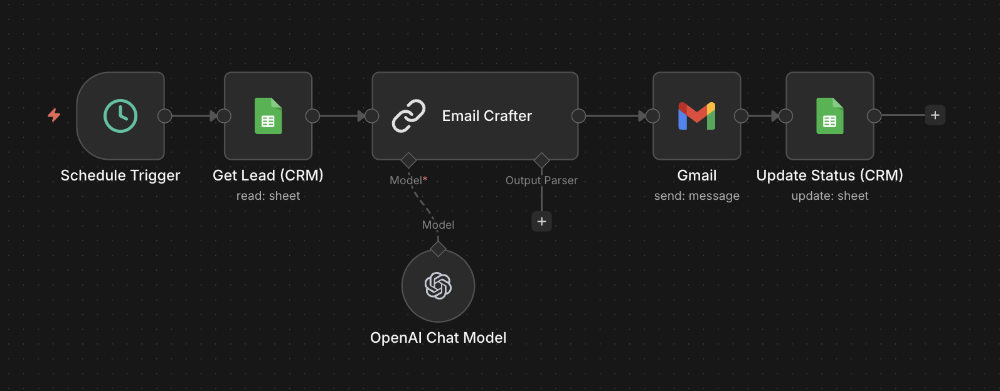

# Simple Recruiter Email Outreach — Setup Guide

## What this workflow does

This workflow automates personalized cold email outreach to recruiters and hiring managers. Instead of copy-pasting the same email over and over, you load your leads into a Google Sheet, run the workflow, and it does the rest.

Here's what happens under the hood:

1. **Schedule Trigger** — fires every 5–7 minutes (randomized so it doesn't look like a bot)
2. **Get Lead (CRM)** — pulls the next contact from your Google Sheet where `Status = Todo`
3. **Email Crafter** — sends the contact's details to GPT-4o Mini, which writes a short, personalized cold email based on their name, job title, and company
4. **Gmail** — sends the email directly from your Gmail account
5. **Update Status (CRM)** — marks that contact's row as `Done` so it won't be emailed again

Each run processes one contact. The next trigger fires a few minutes later and picks up the next one — keeping your outreach steady and human-looking.

---

## How to set it up

### Step 1 — Create your Google Sheet CRM

Create a new Google Sheet and name it whatever you like. Make sure **Sheet1** has exactly these column headers in this order:

| Name | FirstName | Email | Job Title | Company | Status |
|------|-----------|-------|-----------|---------|--------|

- **Name** — full name (e.g. `Jane Smith`)
- **FirstName** — first name only, used in the email subject line (e.g. `Jane`)
- **Email** — their work email
- **Job Title** — their current role (e.g. `Engineering Manager`)
- **Company** — company name (e.g. `Stripe`)
- **Status** — set this to `Todo` for anyone you want to email. The workflow will update it to `Done` after sending.

Fill in your leads, set their `Status` to `Todo`, and save.

---

### Step 2 — Import the workflow into n8n

1. Open your n8n instance
2. Go to **Workflows → Import**
3. Upload `Simple-Recruiter-Email-Outreach.json`
4. n8n will prompt you to connect credentials — do that in the next step

---

### Step 3 — Connect your credentials

You'll need to connect three services:

**Google Sheets**
- Click the **Get Lead (CRM)** node
- Under credentials, connect your Google account via OAuth2
- Then paste your Google Sheet URL or select it from the dropdown
- Do the same for the **Update Status (CRM)** node — both should point to the same sheet

**Gmail**
- Click the **Gmail** node
- Connect the same (or different) Google account via OAuth2

**OpenAI**
- Click the **OpenAI Chat Model** node
- Add your OpenAI API key

---

### Step 4 — Personalize the email prompt (optional)

Open the **Email Crafter** node to see the prompt. It's currently written for Eric — a Senior Software Engineer with ex-Microsoft/Amazon experience. Update it to reflect your own background, experience, and sign-off name before activating.

---

### Step 5 — Activate and let it run

Toggle the workflow to **Active**. It will start sending emails automatically, one contact at a time, every few minutes. Check back on your Google Sheet to watch the `Status` column update from `Todo` to `Done` as each email goes out.

---

## Tips

- Keep your list clean — bad or typo'd emails will cause Gmail send errors
- The workflow only picks up rows where `Status = Todo`, so you can add new leads anytime without disrupting anything
- If you want to pause outreach, just deactivate the workflow — no contacts will be skipped
- Test it first by adding one row with your own email set to `Todo`
