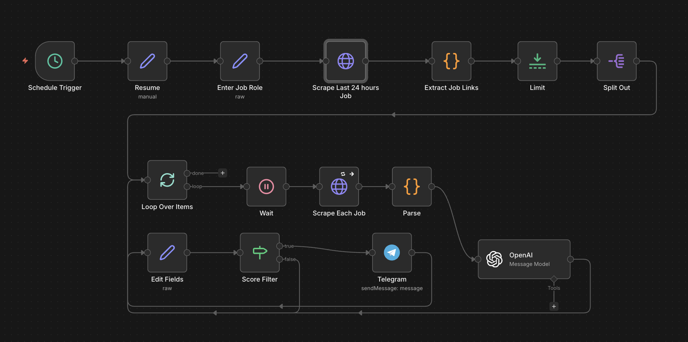

# LinkedIn Job Alert → Telegram

I built this n8n workflow to stop mindlessly scrolling LinkedIn every day looking for new job postings. Instead, it runs automatically, scores each job against my resume using AI, and only pings me on Telegram when the match is good enough. No noise, just relevant jobs.



---

## What it does

Every hour (or however often you schedule it), the workflow:

1. Searches LinkedIn for jobs posted in the last 24 hours based on a role you define
2. Scrapes up to 50 job listings and their full descriptions
3. Sends each job + your resume to OpenAI, which returns a match score out of 100
4. Filters out anything below 50
5. Sends the good ones straight to your Telegram with the title, company, location, score, and apply link

It's fully hands-off once set up.

---

## How the flow works

```
Schedule Trigger
  → Resume (your resume text, stored once)
  → Enter Job Role (set the role you're searching for)
  → Scrape LinkedIn (search results for the last 24 hours)
  → Extract Job Links (parse all job cards from the HTML)
  → Limit (cap at 50 jobs per run)
  → Split Out (one item per job link)
  → Loop Over Items
      → Wait 10s (avoid rate limiting)
      → Scrape Each Job Page
      → Parse (extract title, company, location, job description)
      → OpenAI o3-mini (score resume vs job description)
      → Edit Fields (parse the score from the response)
      → Score Filter (score >= 50?)
          ├── YES → Send Telegram message → next job
          └── NO  → skip → next job
```

---

## How to set it up

### 1. Import the workflow

- In n8n, go to **Workflows → Import**
- Upload `Linkedin-Job-Alert-Telegram.json`

### 2. Add your resume

- Open the **Resume** node
- Paste your resume as plain text in the `value` field
- Keep it clean — no formatting symbols, just readable text

### 3. Set your job role

- Open the **Enter Job Role** node
- Change `"AI Engineer"` to whatever role you're searching for
- Examples: `"Data Engineer"`, `"Backend Engineer"`, `"Product Manager"`

### 4. Set your LinkedIn search location

- Open the **Scrape Last 24 hours Job** node
- The URL contains `geoId=103644278` — this is the United States
- Replace it with your country's geoId if needed (find it by searching on LinkedIn and copying the `geoId` from the URL)

### 5. Connect OpenAI

- Create a credential in n8n under **Credentials → OpenAI**
- Paste your OpenAI API key
- Attach it to the **OpenAI** node

### 6. Connect Telegram

- See the Telegram setup section below
- Attach your Telegram credential to the **Telegram** node
- Set your Chat ID in the **Telegram** node's `chatId` field

### 7. Set the schedule

- Open the **Schedule Trigger** node
- Set how often you want it to run (every hour is a good default)

---

## Setting up your Telegram Bot

This is the part most people get stuck on. Here's the exact process:

**Step 1 — Create a bot**

- Open Telegram and search for `@BotFather`
- Send `/newbot` and follow the prompts (give it a name and username)
- BotFather will give you an **API token** — save this, it's your bot token

**Step 2 — Add the credential in n8n**

- In n8n go to **Credentials → New → Telegram API**
- Paste the bot token and save

**Step 3 — Get your Chat ID**

- Start a conversation with your new bot (search for it on Telegram and hit Start)
- Then open this URL in your browser, replacing `<YOUR_BOT_TOKEN>` with the actual token:
  ```
  https://api.telegram.org/bot<YOUR_BOT_TOKEN>/getUpdates
  ```
- You'll see a JSON response — look for `"chat": {"id": 123456789}` — that number is your Chat ID
- If the response is empty, send any message to your bot first and try again

**Step 4 — Set the Chat ID**

- Open the **Telegram** node in n8n
- Paste your Chat ID into the `chatId` field

---

## Nuances worth knowing

**LinkedIn scraping without an account**
This workflow uses LinkedIn's public job search pages (no login required). LinkedIn occasionally changes its HTML structure, which can break the parsing logic in the `Extract Job Links` or `Parse` nodes. If jobs stop coming through, that's the first place to check.

**The 10 second wait**
The `Wait` node between jobs exists to avoid hitting LinkedIn too aggressively. Don't remove it or you risk getting rate limited or temporarily blocked.

**Score threshold**
The default filter is 50/100. Raise it to 70+ if you're getting too many alerts, lower it if you're getting none. Adjust in the **Score Filter** node.

**OpenAI model**
The workflow uses `o3-mini` which is fast and cheap for this task. You can swap it for `gpt-4o` in the OpenAI node if you want more nuanced scoring, but it will cost more per run.

**Job limit**
The **Limit** node caps at 50 jobs per run. If your search is too broad and returning lots of jobs, narrow your LinkedIn keyword or lower this number to keep runs fast.

**Scheduling**
Running every hour means you'll always see jobs within an hour of them being posted. If that's too frequent, daily is totally fine too — the search already filters to the last 24 hours.

---

## Telegram message format

Each alert you receive looks like this:

```
Title: Senior AI Engineer
Company: Acme Corp
Location: New York, NY
Job Score: 78
Apply: https://www.linkedin.com/jobs/view/...
```

---

## Requirements

- n8n (self-hosted or cloud)
- OpenAI API key
- Telegram bot token + your chat ID
